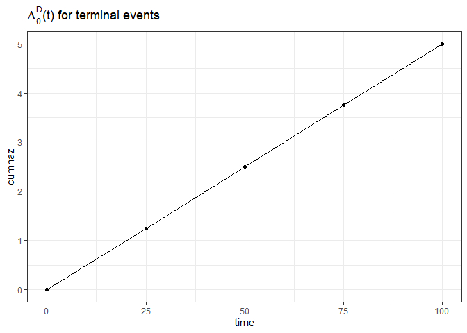

# simpowerrecurrent: Simulation-based sample size calculations for recurrent events with competing deaths

Let $N^*(t)$ denote the expected number of recurrent events by time $t$
and let $D^*$ denote the time of death. Let $C$ denote the time of
censoring. Due to right-censoring, $N(t) = N^*(t \wedge C)$ and
$D = D^* \wedge C$ is observed. Moreover, the censoring indicator is
observed, $\delta = I(D^* \leq C)$. There is only a single binary
treatment variable, $Z$. For each of the $n$ subjects, the following is
observed $X_i = \lbrace N_i(\cdot), D_i, \delta_i, Z_i \rbrace$,
$i=1, \ldots, n$. $X_i$ are assumed to independent and identically
distributed replicated of $X = \lbrace N(\cdot), D, \delta, Z \rbrace$.
It is assumed that $C$ is independent of $Z$.

It is assumed that the proportional means model of Ghosh and Lin (2002)
holds, such that

$$
E(N^*(t) \mid Z) = \mu(t \mid Z) = \mu_0(t) \exp(\beta Z),
$$

where $\mu_0(t)$ is the baseline mean function for recurrent events, and
$\beta$ is the effect of treatment, $Z$, on recurrent events.

Moreover, it is assumed that Cox’s proportional hazard model hold for
the terminal events, such that

$$
\Lambda^D(t\mid Z) = \Lambda_0^D(t) \exp(\gamma Z),
$$

where $\Lambda_0^D(t)$ is the cumulative baseline hazard for death, and
$\gamma$ is the effect of treatment, $Z$, on death.

In order to simulate a single data set according to these models, the
following should be specified

-   The total sample size, $n$. It is assumed that the randomisation is
    1:1.

-   A set of values for $(t, \mu_0(t))$, i.e. the expected number of
    events in the reference group at times $t$.

-   A set of values for $(t, \Lambda_0^D(t))$, i.e. the cumulative
    hazard of death in the reference group at times $t$.

-   The censoring rate through the trial, such that $\Lambda^C(t) = ct$.
    Here, $c$ is supplied.

-   The log-mean ratio, $\beta$, i.e. the effect of treatment on
    recurrent events.

-   The log-hazard ratio, $\gamma$, i.e. the effect of treatment on
    death.

-   Max enrollment day after randomisation, $\tau_{a}$. Uniform accrual
    until $\tau_{a}$ is assumed.

-   Total length of study duration, $\tau_{max}$. Administrative
    censoring occurs at $\tau_{max}$.

In order to perform a power calculation or equivalently estimate a
sample size, the following should additionally be specified

-   The total number of simulations

-   The significance level, $\alpha$

## Download from Github

The functions can be downloaded from GitHub using the below code,

``` r
require(devtools)
#> Indlæser krævet pakke: devtools
#> Indlæser krævet pakke: usethis
devtools::install_github("JulieKFurberg/simpowerrecurrent", force = TRUE)
#> Downloading GitHub repo JulieKFurberg/simpowerrecurrent@HEAD
#> * checking for file 'C:\Users\jukf\AppData\Local\Temp\Rtmpu47zJQ\remotes4d387ab9569a\JulieKFurberg-simpowerrecurrent-c9109ce/DESCRIPTION' ... OK
#> * preparing 'simpowerrecurrent':
#> * checking DESCRIPTION meta-information ... OK
#> * checking for LF line-endings in source and make files and shell scripts
#> * checking for empty or unneeded directories
#>   NB: this package now depends on R (>= 3.5.0)
#>   WARNING: Added dependency on R >= 3.5.0 because serialized objects in
#>   serialize/load version 3 cannot be read in older versions of R.
#>   File(s) containing such objects:
#>     'simpowerrecurrent/README_cache/gfm/powerest_18ae680bc39f8bc5fd656653cd6518ad.RData'
#>     'simpowerrecurrent/README_cache/gfm/powerest_18ae680bc39f8bc5fd656653cd6518ad.rdx'
#>     'simpowerrecurrent/vignettes/simpowerrecurrent_cache/html/powerest_950a02ad4f8b113206c85d240af37217.RData'
#>     'simpowerrecurrent/vignettes/simpowerrecurrent_cache/html/powerest_950a02ad4f8b113206c85d240af37217.rdx'
#> * building 'simpowerrecurrent_0.0.0.9000.tar.gz'
#> Advarsel i utils::tar(filepath, pkgname, compression = compression, compression_level = 9L,  :
#>   storing paths of more than 100 bytes is not portable:
#>   'simpowerrecurrent/vignettes/simpowerrecurrent_cache/html/powerest_950a02ad4f8b113206c85d240af37217.RData'
#> Advarsel i utils::tar(filepath, pkgname, compression = compression, compression_level = 9L,  :
#>   storing paths of more than 100 bytes is not portable:
#>   'simpowerrecurrent/vignettes/simpowerrecurrent_cache/html/powerest_950a02ad4f8b113206c85d240af37217.rdb'
#> Advarsel i utils::tar(filepath, pkgname, compression = compression, compression_level = 9L,  :
#>   storing paths of more than 100 bytes is not portable:
#>   'simpowerrecurrent/vignettes/simpowerrecurrent_cache/html/powerest_950a02ad4f8b113206c85d240af37217.rdx'
#> 
require(simpowerrecurrent)
#> Indlæser krævet pakke: simpowerrecurrent

# A couple extra packages
require(ggplot2)
#> Indlæser krævet pakke: ggplot2
require(survival)
#> Indlæser krævet pakke: survival
require(mets)
#> Indlæser krævet pakke: mets
#> Indlæser krævet pakke: timereg
#> Indlæser krævet pakke: lava
#> 
#> Vedhæfter pakke: 'lava'
#> Det følgende objekt er maskeret fra 'package:ggplot2':
#> 
#>     vars
#> mets version 1.3.1
```

## Simulation of a single data set

The following example displays how to simulate data from the above model
using the required input parameters.

Here, we assume that $n=100$, and that

$$
\mu(t \mid Z) = 0.06 t^2 \exp(-0.2 Z), \quad \Lambda^D(t \mid Z) = 0.05 t \exp(-0.1 Z)
$$

Moreover, it is assumed that the cumulative hazard of being censored
during the trial is,

$$
\Lambda^C(t) = 0.03t.
$$

Furthermore, there is uniform accrual of the $100$ subjects during $10$
days. The study closed after $30$ days from the first enrollment.

``` r
mu0 <- function(time, a){a  * time^2}
LamD0 <- function(time, b){b * time}


times <- seq(0, 100, by = 25)

cumhaz_mu <- data.frame(time = times,
                        cumhaz = mu0(time = times, a = 0.07))

cumhaz_S <- data.frame(time = times,
                       cumhaz = LamD0(time = times, b = 0.05))
# Visual
ggplot(aes(x = time, y = cumhaz), data = cumhaz_mu) +
  geom_line() + ggtitle(expression(mu[0]*"(t) for recurrent events")) +
  geom_point() + theme_bw()
```


``` r
ggplot(aes(x = time, y = cumhaz), data = cumhaz_S) +
  geom_line() + ggtitle(expression(Lambda[0]^D*"(t) for terminal events")) + 
  geom_point() + theme_bw()
```



``` r
# Simulating a single data set
set.seed(1234)
sim1 <- simrecurprop(n = 100, 
                     beta = -0.2,
                     gamma = -0.1,
                     mu0 = cumhaz_mu,
                     Lam0D = cumhaz_S,
                     crate = 0.03,
                     accrualtime = 10,
                     admincens = 30)

head(sim1)
#>   id    start      stop status Z
#> 1  1 9.030126  9.213846      1 0
#> 2  1 9.213846  9.299344      1 0
#> 3  1 9.299344  9.346337      1 0
#> 4  1 9.346337  9.919655      1 0
#> 5  1 9.919655  9.934885      1 0
#> 6  1 9.934885 11.057786      1 0

# Overview of the data set
with(sim1, table(Z, status))
#>    status
#> Z     0   1   2
#>   0  24 999  30
#>   1  21 830  24
```

In the output data set, the following variables are included,

-   `id`: The subject id
-   `start`: The start time of the record for individual i. Counting
    process style
-   `stop`: The stop time of the record for individual i. Counting
    process style
-   `status`: Status at the stopping time for subject i for record j.
-   `Z`: The binary treatment covariate

## Esitimation of power for previous example

``` r
simres1 <- powerest(nsims = 100, 
                    n = 100, 
                    beta = -0.2,
                    gamma = -0.1,
                    mu0 = cumhaz_mu,
                    Lam0D = cumhaz_S, 
                    alpha = 0.05, 
                    crate = 0.03,
                    accrualtime = 10,
                    admincens = 30)

head(simres1$resmat)
#>            beta    sebeta reject?         pval
#> [1,] -0.1790835 0.1658795       0 0.2803201543
#> [2,] -0.2666757 0.1670082       0 0.1103144028
#> [3,] -0.5067710 0.1459409       1 0.0005157491
#> [4,] -0.2689624 0.1870898       0 0.1505444535
#> [5,] -0.2021331 0.1746448       0 0.2471108580
#> [6,] -0.3094645 0.1412668       1 0.0284780307

simres1$power
#> [1] 0.28
simres1$betamean
#> [1] -0.2113135
simres1$betasemean
#> [1] 0.1636032
```

The results from fitting a Ghosh and Lin model to each simulated data
set is contained in the data.frame, `resmat`, with the columns `beta`,
`sebeta`, `reject?` and `pval`. There is one row per simulation in
`resmat`. The results correspond to the estimated $\hat{\beta}$ and
$\text{se}(\hat{\beta})$ from the Ghosh and Lin model as well as the
decision to reject the null or not (alongside a two-sided p-value).
Here, the hypotheses of interest are,

$$
H_0: \beta = 0, \quad H_a: \beta \neq 0.
$$

The approximate power is contained in `power`. The average of all
$\hat{\beta}$ across simulations is contained in `betamean`. The average
of the standard errors for $\hat{\beta}$ across simulations is contained
in `betasemean`.
