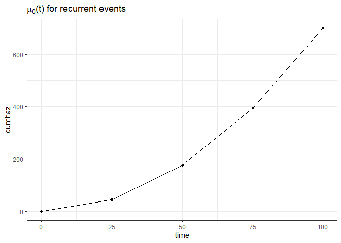

# simpowerrecurrent: Simulation-based sample size calculations for recurrent events with competing deaths

Let $N^*(t)$ denote the expected number of recurrent events by time $t$
and let $D^*$ denote the time of death. Let $C$ denote the time of
censoring. Due to right-censoring, $N(t) = N^*(t \wedge C)$ and
$D = D^* \wedge C$ is observed. Moreover, the censoring indicator is
observed, $\delta = I(D^* \leq C)$. There is only a single binary
treatment variable, $Z$. For each of the $n$ subjects, the following is
observed $X_i = \lbrace N_i(\cdot), D_i, \delta_i, Z_i \rbrace$,
$i=1, \ldots, n$. $X_i$ are assumed to independent and identically
distributed replicated of $X = \lbrace N(\cdot), D, \delta, Z \rbrace$.
It is assumed that $C$ is independent of $Z$. Moreover, it is assumed
that $N^*(\cdot)$ and $D^*$ are conditionally independent given $Z$.

It is assumed that the proportional means model of Ghosh and Lin (2002)
holds, such that $$
E(N(t) \mid Z) = \mu(t \mid Z) = \mu_0(t) \exp(\beta Z),
$$ where $\mu_0(t)$ is the baseline mean function for recurrent events,
and $\beta$ is the effect of treatment, $Z$, on recurrent events.

Moreover, it is assumed that Cox’s proportional hazard model hold for
the terminal events, such that $$
\Lambda^D(t\mid Z) = \Lambda_0^D(t) \exp(\gamma Z),
$$ where $\Lambda_0^D(t)$ is the cumulative baseline hazard for death,
and $\gamma$ is the effect of treatment, $Z$, on death.

In order to simulate a single data set according to these models, the
following should be specified

-   The total sample size, $n$. It is assumed that the randomisation is
    1:1.

-   A set of values for $(t, \mu_0(t))$, i.e. the expected number of
    events in the reference group at times $t$.

-   A set of values for $(t, \Lambda_0^D(t))$, i.e. the cumulative
    hazard of death in the reference group at times $t$.

-   The censoring rate through the trial, such that $\Lambda^C(t) = ct$.
    Here, $c$ is supplied.

-   The log-mean ratio, $\beta$, i.e. the effect of treatment on
    recurrent events.

-   The log-hazard ratio, $\gamma$, i.e. the effect of treatment on
    death.

-   Max enrollment day after randomisation, $\tau_{a}$. Uniform accrual
    until $\tau_{a}$ is assumed.

-   Total length of study duration, $\tau_{max}$. Administrative
    censoring occurs at $\tau_{max}$.

In order to perform a power calculation or equivalently estimate a
sample size, the following should additionally be specified

-   The total number of simulations

-   The significance level, $\alpha$

## Download from Github

The functions can be downloaded from GitHub using the below code,

``` r
require(devtools)
#> Indlæser krævet pakke: devtools
#> Indlæser krævet pakke: usethis
devtools::install_github("JulieKFurberg/simpowerrecurrent", force = TRUE)
#> Downloading GitHub repo JulieKFurberg/simpowerrecurrent@HEAD
#> * checking for file 'C:\Users\jukf\AppData\Local\Temp\RtmpmgEyfY\remotes54487b0d7719\JulieKFurberg-simpowerrecurrent-1b0855b/DESCRIPTION' ... OK
#> * preparing 'simpowerrecurrent':
#> * checking DESCRIPTION meta-information ... OK
#> * checking for LF line-endings in source and make files and shell scripts
#> * checking for empty or unneeded directories
#> * building 'simpowerrecurrent_0.0.0.9000.tar.gz'
#> 
require(simpowerrecurrent)
#> Indlæser krævet pakke: simpowerrecurrent

# A couple extra packages
require(ggplot2)
#> Indlæser krævet pakke: ggplot2
require(survival)
#> Indlæser krævet pakke: survival
require(mets)
#> Indlæser krævet pakke: mets
#> Indlæser krævet pakke: timereg
#> Indlæser krævet pakke: lava
#> 
#> Vedhæfter pakke: 'lava'
#> Det følgende objekt er maskeret fra 'package:ggplot2':
#> 
#>     vars
#> mets version 1.3.0
```

## Simulation of a single data set

The following example displays how to simulate data from the above model
using the required input parameters.

``` r
mu0 <- function(time, a){a  * time^2}
LamD0 <- function(time, b){b * time}


times <- seq(0, 100, by = 25)

cumhaz_mu <- data.frame(time = times,
                        cumhaz = mu0(time = times, a = 0.1))

cumhaz_S <- data.frame(time = times,
                       cumhaz = LamD0(time = times, b = 0.01))
# Visual
ggplot(aes(x = time, y = cumhaz), data = cumhaz_mu) +
  geom_line() + ggtitle(expression(mu[0]*"(t) for recurrent events")) +
  geom_point()
```



``` r
ggplot(aes(x = time, y = cumhaz), data = cumhaz_S) +
  geom_line() + ggtitle(expression(Lambda[0]^D*"(t) for terminal events")) + 
  geom_point()
```


``` r
# Simulating a single data set
sim1 <- simrecurprop(n = 100, 
                     beta = -0.2,
                     gamma = -0.1,
                     mu0 = cumhaz_mu,
                     Lam0D = cumhaz_S,
                     crate = 0.01,
                     accrualtime = 10,
                     admincens = 100)

head(sim1)
#>   id     start      stop status Z
#> 1  1  7.566699  7.849969      1 1
#> 2  1  7.849969  7.979857      1 1
#> 3  1  7.979857  8.830566      1 1
#> 4  1  8.830566  9.146859      1 1
#> 5  1  9.146859 10.006295      1 1
#> 6  1 10.006295 10.088154      1 1

# Overview of the data set
with(sim1, table(Z, status))
#>    status
#> Z      0    1    2
#>   0    9 3247    9
#>   1   11 4037   11
```

In the output data set, the following variables are included,

-   `id`: The subject id
-   `start`: The start time of the record for individual i. Counting
    process style
-   `stop`: The stop time of the record for individual i. Counting
    process style
-   `status`: Status at the stopping time for subject i for record j.
-   `Z`: The binary treatment covariate

## Esitimation of power for previous example

``` r
simres1 <- powerest(nsims = 100, 
                    n = 100, 
                    beta = -0.2,
                    gamma = -0.1,
                    mu0 = cumhaz_mu,
                    Lam0D = cumhaz_S, 
                    alpha = 0.05, 
                    crate = 0.01,
                    accrualtime = 10,
                    admincens = 100)

simres1
#> $resmat
#>                 beta     sebeta reject?         pval
#>   [1,] -0.2097155772 0.08174878       1 0.0103066914
#>   [2,] -0.1683279578 0.08670298       0 0.0522058711
#>   [3,] -0.1839875868 0.09898548       0 0.0630649781
#>   [4,] -0.0567333504 0.10995599       0 0.6058794355
#>   [5,] -0.1826926619 0.09842488       0 0.0634302611
#>   [6,] -0.2172818227 0.11161166       0 0.0515627501
#>   [7,] -0.3335392300 0.09482584       1 0.0004358172
#>   [8,] -0.0330887571 0.08724990       0 0.7045087600
#>   [9,] -0.0237845126 0.10214822       0 0.8158832061
#>  [10,] -0.2826936039 0.08145023       1 0.0005190021
#>  [11,] -0.3095767956 0.08641156       1 0.0003402103
#>  [12,] -0.1103762519 0.09000102       0 0.2200523542
#>  [13,] -0.0658095845 0.11859067       0 0.5789421591
#>  [14,] -0.2047362343 0.09645987       1 0.0337956402
#>  [15,] -0.1117622628 0.10154690       0 0.2710718734
#>  [16,]  0.1219498340 0.09409073       0 0.1949452676
#>  [17,] -0.0862672267 0.09540158       0 0.3658609214
#>  [18,] -0.0720703396 0.09237065       0 0.4352556063
#>  [19,]  0.0006381527 0.10723977       0 0.9952520487
#>  [20,] -0.3433733316 0.10282502       1 0.0008396112
#>  [21,] -0.0678548526 0.08813201       0 0.4413456263
#>  [22,] -0.0815071337 0.10238714       0 0.4259924787
#>  [23,] -0.0598436648 0.08637107       0 0.4883930152
#>  [24,]  0.0365266600 0.09680068       0 0.7059217825
#>  [25,] -0.2685672571 0.10593824       1 0.0112405461
#>  [26,] -0.0685226036 0.10514273       0 0.5145880630
#>  [27,]  0.0729539265 0.09369052       0 0.4361745852
#>  [28,] -0.2214464630 0.09197935       1 0.0160592122
#>  [29,]  0.0124989480 0.09449561       0 0.8947706173
#>  [30,]  0.0582849896 0.09812048       0 0.5525023885
#>  [31,] -0.0119819688 0.11877295       0 0.9196446910
#>  [32,] -0.0239697998 0.09039556       0 0.7908818358
#>  [33,] -0.0892363284 0.09588006       0 0.3520046931
#>  [34,] -0.2511329009 0.07480845       1 0.0007878953
#>  [35,] -0.0987102950 0.08984615       0 0.2719167460
#>  [36,]  0.0069075676 0.10466915       0 0.9473823588
#>  [37,]  0.0190336995 0.10603198       0 0.8575380087
#>  [38,] -0.2144365427 0.08906586       1 0.0160569852
#>  [39,] -0.2383280191 0.09041474       1 0.0083904036
#>  [40,] -0.1505114029 0.10073733       0 0.1351500984
#>  [41,] -0.0402443143 0.09343743       0 0.6666801950
#>  [42,] -0.1023018095 0.09549381       0 0.2840378772
#>  [43,] -0.0873109135 0.08706595       0 0.3159508576
#>  [44,] -0.2051149740 0.08988383       1 0.0224892892
#>  [45,] -0.1359107296 0.09431257       0 0.1495657500
#>  [46,] -0.1199190229 0.10068643       0 0.2336477772
#>  [47,] -0.0682326982 0.10653490       0 0.5218653057
#>  [48,] -0.1743418365 0.08282417       1 0.0352945015
#>  [49,]  0.0926405835 0.10978653       0 0.3987673839
#>  [50,] -0.0655713619 0.10157339       0 0.5185666031
#>  [51,] -0.1190630598 0.10197165       0 0.2429643328
#>  [52,] -0.1541301848 0.08643010       0 0.0745386265
#>  [53,] -0.0655956792 0.11086838       0 0.5540825433
#>  [54,] -0.0651631322 0.09043383       0 0.4711793857
#>  [55,] -0.1481569724 0.09422301       0 0.1158560488
#>  [56,]  0.0793971654 0.08827812       0 0.3684407143
#>  [57,] -0.1487916306 0.10156803       0 0.1429357746
#>  [58,] -0.0936931771 0.10909160       0 0.3904240096
#>  [59,] -0.1700550312 0.10245241       0 0.0969458291
#>  [60,] -0.1528755354 0.10057600       0 0.1285109538
#>  [61,]  0.0077753551 0.09524669       0 0.9349378717
#>  [62,] -0.0970358412 0.08116556       0 0.2318801397
#>  [63,] -0.1629546529 0.08834610       0 0.0651098644
#>  [64,]  0.0183103714 0.10680193       0 0.8638759789
#>  [65,] -0.2306478570 0.10855970       1 0.0336185210
#>  [66,] -0.1347043453 0.08681139       0 0.1207364908
#>  [67,] -0.1789501469 0.09350513       0 0.0556456773
#>  [68,] -0.0717104938 0.08886186       0 0.4196731497
#>  [69,] -0.1341863111 0.09194865       0 0.1444656623
#>  [70,] -0.0892438209 0.07935651       0 0.2607612784
#>  [71,] -0.0202773871 0.09308699       0 0.8275594995
#>  [72,] -0.1991162915 0.10126660       1 0.0492687888
#>  [73,] -0.2274674750 0.10347616       1 0.0279306073
#>  [74,] -0.2253954720 0.08726537       1 0.0097981013
#>  [75,] -0.2625559966 0.10745126       1 0.0145460026
#>  [76,] -0.1901568448 0.09049373       1 0.0356123478
#>  [77,] -0.0743540149 0.09863834       0 0.4509666662
#>  [78,] -0.1941656307 0.10288003       0 0.0591197813
#>  [79,] -0.1089472873 0.09317191       0 0.2422768244
#>  [80,]  0.0308645400 0.10877003       0 0.7765946262
#>  [81,]  0.0257550894 0.09985017       0 0.7964552397
#>  [82,] -0.1175310842 0.10808981       0 0.2768836625
#>  [83,] -0.1440380215 0.09601365       0 0.1335670844
#>  [84,]  0.0212987079 0.10840613       0 0.8442411837
#>  [85,]  0.0940566963 0.11490691       0 0.4130449707
#>  [86,] -0.1368514340 0.09059809       0 0.1309074096
#>  [87,] -0.1095594875 0.10009549       0 0.2737139873
#>  [88,] -0.2665297474 0.09713493       1 0.0060711714
#>  [89,] -0.1084605445 0.10022309       0 0.2791675922
#>  [90,] -0.1073085690 0.09832842       0 0.2751285548
#>  [91,] -0.1601127712 0.10819016       0 0.1388946076
#>  [92,] -0.1572048358 0.09597217       0 0.1014164457
#>  [93,] -0.0776590191 0.10678231       0 0.4670637498
#>  [94,] -0.1098294734 0.09722504       0 0.2586271795
#>  [95,] -0.1227985801 0.10375006       0 0.2365714084
#>  [96,] -0.0691542612 0.10200641       0 0.4978095354
#>  [97,] -0.0243144081 0.09966204       0 0.8072551439
#>  [98,] -0.0367342523 0.09988233       0 0.7130408037
#>  [99,] -0.0789339310 0.09956558       0 0.4279040989
#> [100,]  0.0325538931 0.09889769       0 0.7420291731
#> 
#> $power
#> [1] 0.2
#> 
#> $betamean
#> [1] -0.1065578
#> 
#> $betasemean
#> [1] 0.09741898
#> 
#> $na.obs
#> [1] 0
```

The results from fitting a Ghosh and Lin model to each simulated data
set is contained in the data.frame, `resmat`, with the columns `beta`,
`sebeta`, `reject` and `pval`. There is one row per simulation in
`resmat`. The results correspond to the estimated $\hat{\beta}$ and
$\text{se}(\hat{\beta})$ from the Ghosh and Lin model as well as the
decision to reject the null or not (alongside a two-sided p-value).
Here, the hypotheses of interest are, $$
H_0: \beta = 0, \quad H_a: \beta \neq 0.
$$ The approximate power is contained in `power`. The average of all
$\hat{\beta}$ across simulations is contained in `betamean`. The average
of the standard errors for $\hat{\beta}$ across simulations is contained
in `betasemean`.
